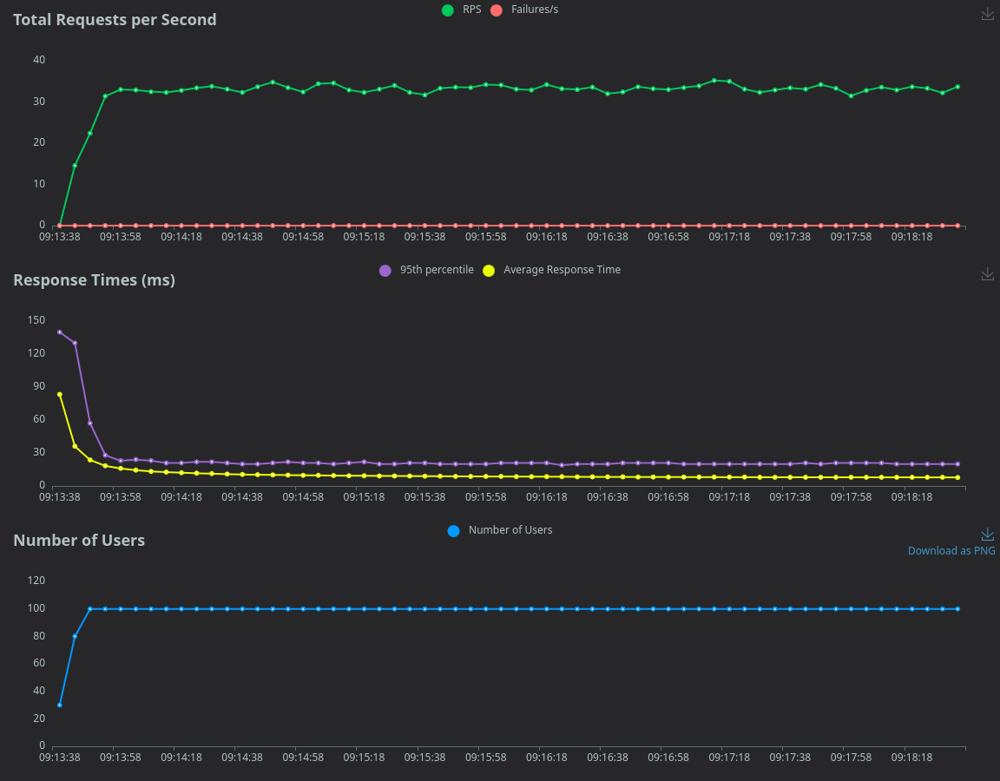
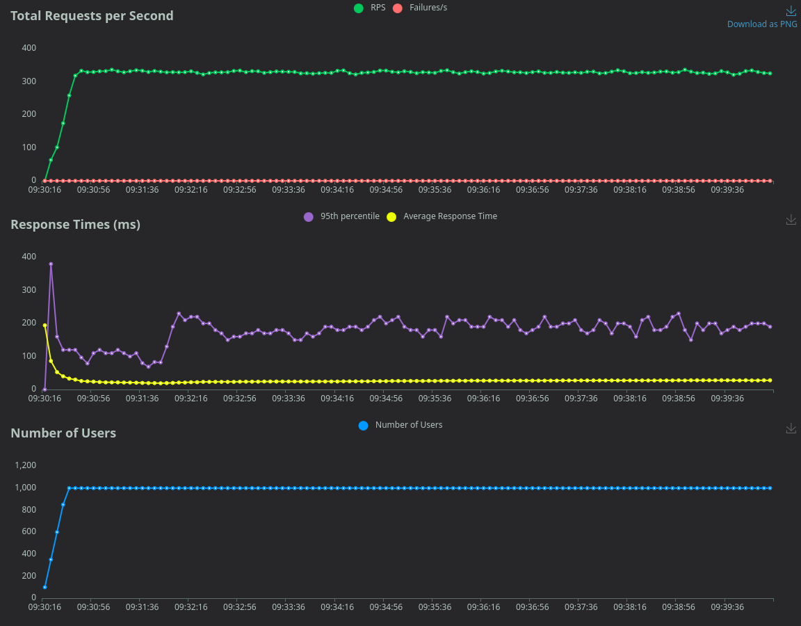
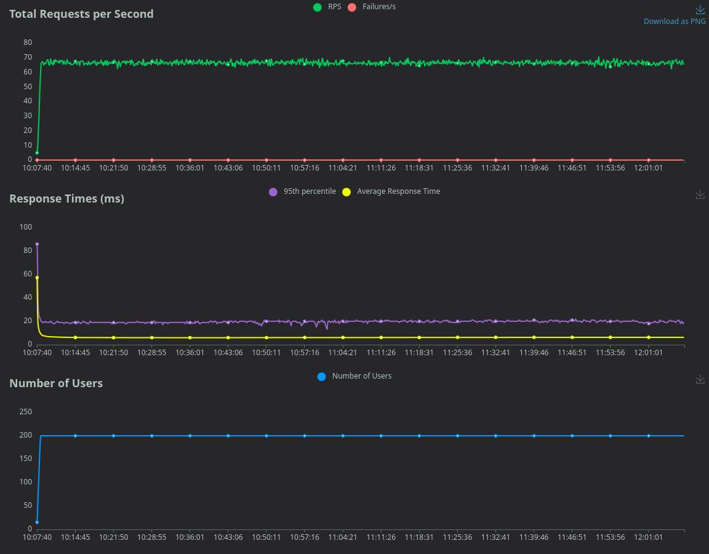
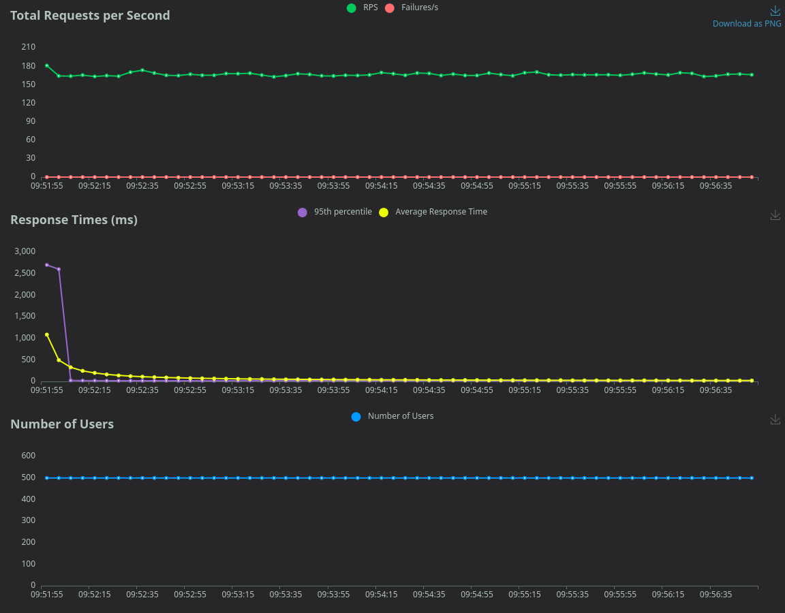
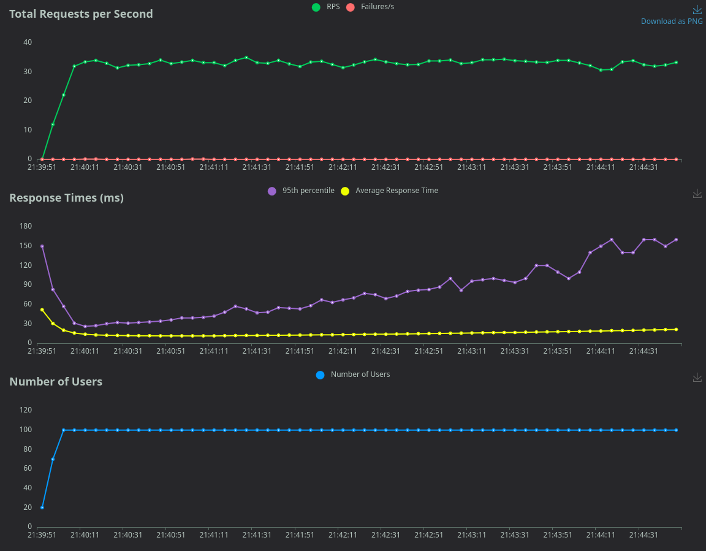
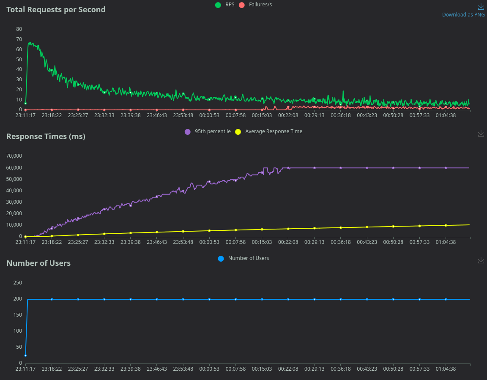
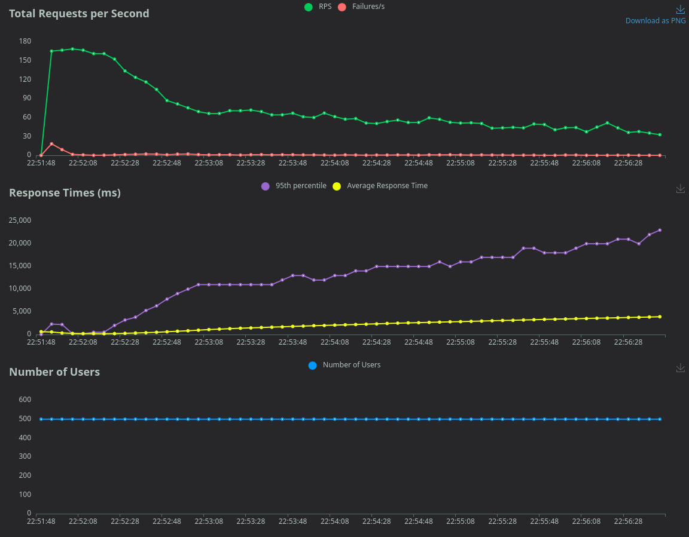

# QA Test Report


## Test System Information

```
Ubuntu                     | 24.04 LTS   |
├── Vagrant                | 2.4.9       |
│   └── Debian             | 13 (Trixie) | http://10.80.0.100
│       ├── Docker         | 26.1.5      |
│       └── Docker Compose | 2.26.1      |
│           ├── Simple API | 1.0         | http://10.80.0.100:8080
│           ├── Redis      | 8.6.0       |
│           ├── Prometheus | 2.52.0      |
│           └── Grafana    | 11.0.0      | http://10.80.0.100:3000
├── libvirt                | 10.0.0      |
├── Python                 | 3.12.3      |
├── Ansible core           | 2.20.2      |
└── Locust                 | 2.24.0      | http://localhost:8089
```


## Test Objective

The objective of this test cycle was to validate the performance, stability, and response time of the Simple API.
Moreover, find possible issues in the system.


## Test Approach

* The test was performed with Locust
* Collecting data with Locust, Btop, and Grafana
  * Locust: Generating load on the API and checking response time and errors, and collecting statistics from the VM via libvirt
  * Btop: Show CPU, memory, disk, and network usage on the VM
  * Grafana: Show CPU and memory (and many more) usage on the VM
* Managing the VM with Vagrant and Ansible
* Test output formats are CSV and HTML (see in the [stats/](./stats) folder)


### What Types of Performance Tests Were Used?


#### Load Testing

Evaluates system behavior under expected user loads.

* Simulates 100 concurrent users
* Adds 10 users per second until the total reaches 100
* Runs the test for 5 minutes


#### Stress Testing

Pushes the system beyond its capacity to find breaking points.

* Simulates 1000 concurrent users
* Adds 50 users per second until the total reaches 1000
* Runs the test for 10 minutes


#### Soak Testing

Runs the system over an extended period to check for memory leaks or stability issues.

* Simulates 200 concurrent users
* Adds 5 users per second until the total reaches 200
* Runs the test for 2 hours


#### Spike Testing

Assesses the system's ability to handle sudden traffic surges.

* Simulates 500 concurrent users
* Adds 500 users immediately
* Runs the test for 5 minutes


## Test Execution Summary


### Testing With A Small Constant Database

In these tests, it just requests data from the API.

---

#### Load Testing

|            | Requests | Fails | Current RPS | Current Failures/s | Response time 95%ile (ms) |
| ---------- | -------- | ----- | ----------- | ------------------ | ------------------------- |
| Aggregated | 9891     | 0     | 34.2        | 0                  | 21                        |




##### VM Metrics In Idle State


##### VM Metrics Under Test


##### Summary

The VM is healthy. It can handle the given load.

---

#### Stress Testing

|            | Requests | Fails | Current RPS | Current Failures/s | Response time 95%ile (ms) |
| ---------- | -------- | ----- | ----------- | ------------------ | ------------------------- |
| Aggregated | 194951   | 0     | 327         | 0                  | 180                       |




##### VM Metrics In Idle State


##### VM Metrics Under Test


##### Summary

The VM is healthy. It can handle the given load.

---

#### Soak Testing

|            | Requests | Fails | Current RPS | Current Failures/s | Response time 95%ile (ms) |
| ---------- | -------- | ----- | ----------- | ------------------ | ------------------------- |
| Aggregated | 477543   | 0     | 65.9        | 0                  | 20                        |




##### VM Metrics In Idle State


##### VM Metrics Under Test


##### Summary

The VM is healthy. It can handle the given load.

---

#### Spike Testing

|            | Requests | Fails | Current RPS | Current Failures/s | Response time 95%ile (ms) |
| ---------- | -------- | ----- | ----------- | ------------------ | ------------------------- |
| Aggregated | 49979    | 0     | 167.3       | 0                  | 17                        |




##### VM Metrics In Idle State


##### VM Metrics Under Test


##### Summary

The VM is healthy. It can handle the given load.
However, at the beginning, the CPU load was high, but after that it settled down.
We can see this in the response time as well.

---


### Testing With An Increasing Database

In these tests, it requests and sends data to the API.

---

#### Load Testing

|            | Requests | Fails | Current RPS | Current Failures/s | Response time 95%ile (ms) |
| ---------- | -------- | ----- | ----------- | ------------------ | ------------------------- |
| Aggregated | 9852     | 2     | 32.4        | 0                  | 100                       |




##### VM Metrics In Idle State


##### VM Metrics Under Test


##### Summary

The VM is healthy. It can handle the given load, but errors happen.
When it tries to request or update an item, it gets a 404 (Not Found) error.
The response time continuously increases as the database size increases.

---

#### Stress Testing

|            | Requests | Fails | Current RPS | Current Failures/s | Response time 95%ile (ms) |
| ---------- | -------- | ----- | ----------- | ------------------ | ------------------------- |
| Aggregated | 30556    | 404   | 23.6        | 0.2                | 39000                     |


##### VM Metrics In Idle State


##### VM Metrics Under Test


##### Summary

The VM has a heavy CPU usage.
It can handle most of the given load, but lots of errors happen, and the response is really slow.
When it tries to request or update an item, it gets a 404 (Not Found) error.
The response time continuously increases as the database size increases.

---

#### Soak Testing

|            | Requests | Fails | Current RPS | Current Failures/s | Response time 95%ile (ms) |
| ---------- | -------- | ----- | ----------- | ------------------ | ------------------------- |
| Aggregated | 107263   | 7068  | 6.4         | 2.7                | 60000                     |




##### VM Metrics In Idle State


##### VM Metrics Under Test


##### Summary

After a couple of minutes, the VM has heavy CPU usage.
It can handle most of the given load, but lots of errors happen, and the response is extremely slow.
When it tries to request or update an item, it gets a 404 (Not Found) error. Also, it has many timeout errors.
The response time continuously increases as the database size increases.
After an hour, the response time was stabilized at 60 seconds. In that time, the failures/s also higher.

---

#### Spike Testing

|            | Requests | Fails | Current RPS | Current Failures/s | Response time 95%ile (ms) |
| ---------- | -------- | ----- | ----------- | ------------------ | ------------------------- |
| Aggregated | 21084    | 262   | 36.2        | 0.1                | 17000                     |




##### VM Metrics In Idle State


##### VM Metrics Under Test


##### Summary

The VM has a heavy CPU usage.
It can handle most of the given load, but lots of errors happen, and the response is really slow.
When it tries to request or update an item, it gets a 404 (Not Found) error.
The response time continuously increases as the database size increases.

---


## Found Defects


### 404 (Not Found) Errors

Found error message in the logs:

```
DefaultHandlerExceptionResolver : Resolved [org.springframework.web.context.request.async.AsyncRequestNotUsableExcepti on: ServletOutputStream failed to write: java.io.IOException: Broken pipe]
```

Probably a race condition, or somehow it cannot handle too many requests.


### Response Time Increases With The Database Size

The `GET /books` request responds back with all of the books in the database.

A possible solution for this problem is to use pagination and/or caching.


## Conclusion

The Simple API is a fast REST API, thanks that is using Redis.
However, it has some issues that should be handled.
